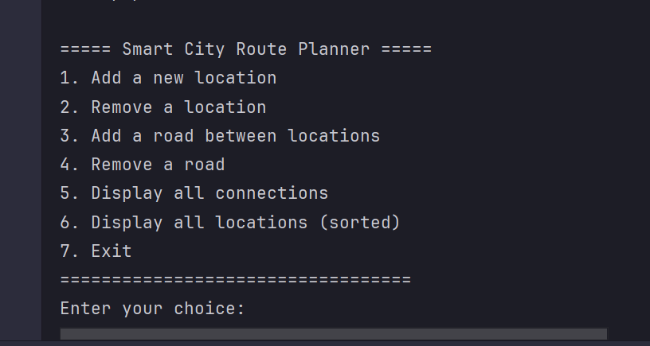

# 🗺️ Smart City Route Planner


- **Assessment:** Graded Practical Assignment 01
- **Module:** CIT300 - Data Structures and Algorithms
- **Degree program:** Bachelor of Applied Information Technology (BAIT)
- **Faculty:** Faculty of Computing and IT
- **University:** Sri Lanka Technology Campus (SLTC)


This project is a console-based application for the **CIT300 Data Structures and Algorithms** module. It models a city's transportation network using graph data structures.

---

## 👥 Group Details

- *22UG3-0235* - Mihir Chakma
- *22UG3-0570* - Thavalampitiye Dhammika
- *22UG3-0912* - Pandigamage Saleela Kaushal
- *22UG3-0108* - Ruchira Vishvajith Dharma Shri

---

## 📋 Features

The system provides a menu-driven interface to:

  * Add a new location (vertex)
  * Remove an existing location
  * Add a road between two locations (edge)
  * Remove a road between two locations
  * Display all connections (graph's adjacency list)
  * Display all locations (sorted alphabetically)

---

## 🏗️ Core Data Structures Implemented

This project demonstrates the relationship between different data structures to build a single application:

  * **Graph (Adjacency List):** Used to represent the city map, with locations as vertices and roads as edges.
  * **AVL Tree:** Used to store and manage the list of all locations, allowing for efficient, $O(\log n)$ searching and alphabetical display.
  * **Queues/Stacks:** Used to perform graph traversal operations like Breadth-First Search (BFS) or Depth-First Search (DFS).

---

## 🧑‍💻 Team & Contributions

| Member | Task |
| :--- | :--- |
| **Member 1** | *22UG3-0912* - Implemented Graph Data Structure . |
| **Member 2** | *22UG3-0108* - Implemented Location/Road Management. |
| **Member 3** | *22UG3-0570* - Implemented AVL Tree Implementation. |
| **Member 4** | *22UG3-0235* - Developed UI & Integration and the main user interface. |

---

## 📂 Project Directory Structure

```
smart-city-planner/
└── src                        <-- (Main source code folder)
    └── com
        └── smartcity
            │
            ├── Main.java          <-- 💻 Member 4: UI, Menu, and Integration
            │
            ├── model              <-- (Package for our data structures)
            │   ├── CityGraph.java       <-- 🗺️ Member 1: Graph implementation
            │   ├── LocationNode.java    <-- 🌳 Member 3: AVL Tree Node
            │   └── LocationAVLTree.java <-- 🌳 Member 3: AVL Tree Logic
            │
            └── service            <-- (Package for our application logic)
                └── RoutePlanner.java  <-- ⚙️ Member 2: Location/Road Management
```

---

## User Interface



---

## Development (Core Tools)

### Java Development Kit (JDK):
  - **Recommendation:** A recent, stable version like *JDK 17 (LTS)* or *JDK 21 (LTS)* or *JDK 25 (LTS)* is recommended.

### Integrated Development Environment (IDE):
  - **Recommended Options:**
    - **IntelliJ IDEA (Community Edition)** [IntelliJ IDEA](https://www.jetbrains.com/idea/)
    - **Visual Studio Code:** A lightweight and popular choice. You'll need to install the "Extension Pack for Java" from its marketplace.

---

## 🚀 How to Run

1.  Clone the repository:

    ```bash
    
    git clone <project-repository-url>
    ```
    
3.  Navigate to the `src` directory:

    ```bash
    
    cd smart-city-planner/src
    ```
    
5.  Compile the Java files:

    ```bash
    
    javac com/smartcity/Main.java com/smartcity/model/*.java com/smartcity/service/*.java
    ```
    
7.  Run the main application:

    ```bash
    
    java com.smartcity.Main
    ```

**OR**

1. Clone the repository.
2. Run the project in the most common Java IDEs.
3. The process is very similar for all of them: you just need to open the main project folder and then find and run the ***Main.java*** file.
